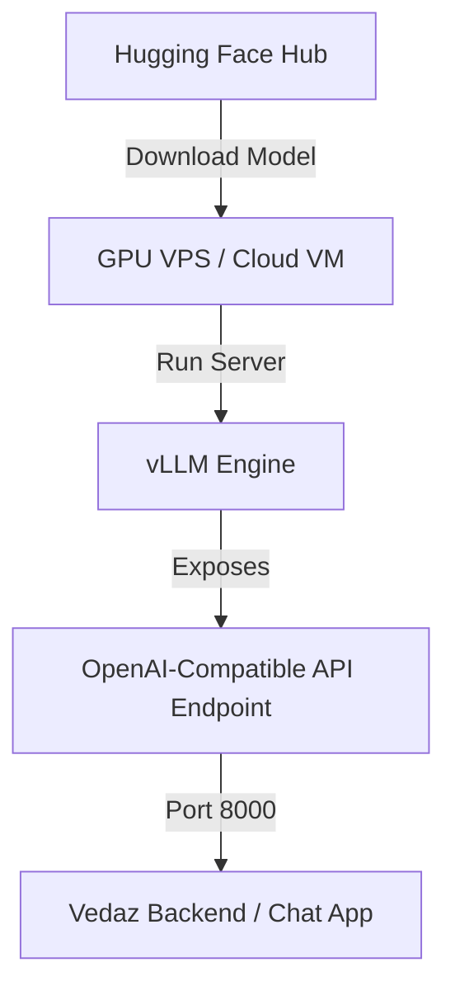

# Guide: Hosting Fine-Tuned Qwen2.5 on a VPS using vLLM

This document outlines the step-by-step process to host the fine-tuned Vedaz Astrologer model on a GPU-enabled Virtual Private Server (VPS) using **vLLM** (Virtual Large Language Model), which is optimized for high-throughput and low-latency LLM serving.

---

## 🏗️ Architecture Overview



---

## 🛠️ Step 1: VPS Requirements & Provisioning

Since LLM serving requires GPU acceleration, you must lease a GPU-enabled VPS. 

### Recommended Hardware Specs (for Qwen2.5-1.5B)
*   **Provider:** RunPod, Vast.ai, Lambda Labs, AWS (g5.xlarge), or GCP (g2-standard-4).
*   **GPU:** 1x NVIDIA T4 (16GB VRAM) or L4 (24GB VRAM). (T4 is highly cost-effective, ~$0.20/hour).
*   **VRAM:** Minimum 8GB (Qwen-1.5B merged model needs ~3GB to load).
*   **OS:** Ubuntu 22.04 LTS (default).

---

## 📦 Step 2: System Setup

Once logged into your VPS via SSH, run the following commands to install Nvidia drivers, CUDA, Python, and vLLM.

```bash
# Update system package registry
sudo apt update && sudo apt upgrade -y

# Install Python 3.10+ and pip
sudo apt install python3-pip python3-venv -y

# Verify CUDA installation (vLLM requires CUDA 12.1+)
nvidia-smi
```

---

## 🐍 Step 3: Install vLLM

It is recommended to install vLLM inside a Python virtual environment to avoid dependency conflicts.

```bash
# Create and activate virtual environment
python3 -m venv vllm_env
source vllm_env/bin/activate

# Install vLLM (this will automatically pull PyTorch and necessary CUDA dependencies)
pip install pip --upgrade
pip install vllm
```

---

## 🚀 Step 4: Host the Model

Depending on whether you want to host the **Merged Model** or the **LoRA Adapter**, choose one of the options below.

### Option A: Hosting the Merged Model (Recommended)
Since we merged the weights during Step 9 of the training pipeline, we can serve it as a standalone model. Replace `subhi-tiwari77/vedaz-astrologer-qwen25-1.5b` with your public or private Hugging Face repository ID.

```bash
# Launch vLLM server
python3 -m vllm.entrypoints.openai.api_server \
    --model subhi-tiwari77/vedaz-astrologer-qwen25-1.5b \
    --port 8000 \
    --host 0.0.0.0
```

### Option B: Hosting Base Model + LoRA Adapter dynamically
If you preferred not to merge the models and want to dynamically load the LoRA weights on top of the base Qwen model:

```bash
# Launch vLLM server with LoRA enabled
python3 -m vllm.entrypoints.openai.api_server \
    --model Qwen/Qwen2.5-1.5B-Instruct \
    --enable-lora \
    --lora-modules vedaz-astrologer=subhi-tiwari77/vedaz-astrologer-qwen25-1.5b-adapter \
    --port 8000 \
    --host 0.0.0.0
```

*(Note: If your Hugging Face repository is **private**, run `huggingface-cli login` on the VPS first and supply your read-access token).*

---

## 📡 Step 5: Test the API Endpoint

vLLM exposes an **OpenAI-compatible REST API** on port `8000`. You can query it from another terminal on the VPS or externally:

```bash
curl http://localhost:8000/v1/chat/completions \
  -H "Content-Type: application/json" \
  -d '{
    "model": "subhi-tiwari77/vedaz-astrologer-qwen25-1.5b",
    "messages": [
      {"role": "system", "content": "You are Vedaz AI Vedic astrologer."},
      {"role": "user", "content": "Meri shadi kab hogi?"}
    ]
  }'
```

---

## 🛡️ Step 6: Keep the Server Running (Production Ready)

To keep vLLM running in the background even after you close the SSH connection, configure a system service or use `pm2`.

```bash
# Install PM2 (Process Manager)
sudo apt install nodejs npm -y
sudo npm install pm2 -g

# Start vLLM with PM2
pm2 start "python3 -m vllm.entrypoints.openai.api_server --model subhi-tiwari77/vedaz-astrologer-qwen25-1.5b --port 8000 --host 0.0.0.0" --name vedaz-llm-api

# Save PM2 state so it auto-starts on reboot
pm2 save
pm2 startup
```
